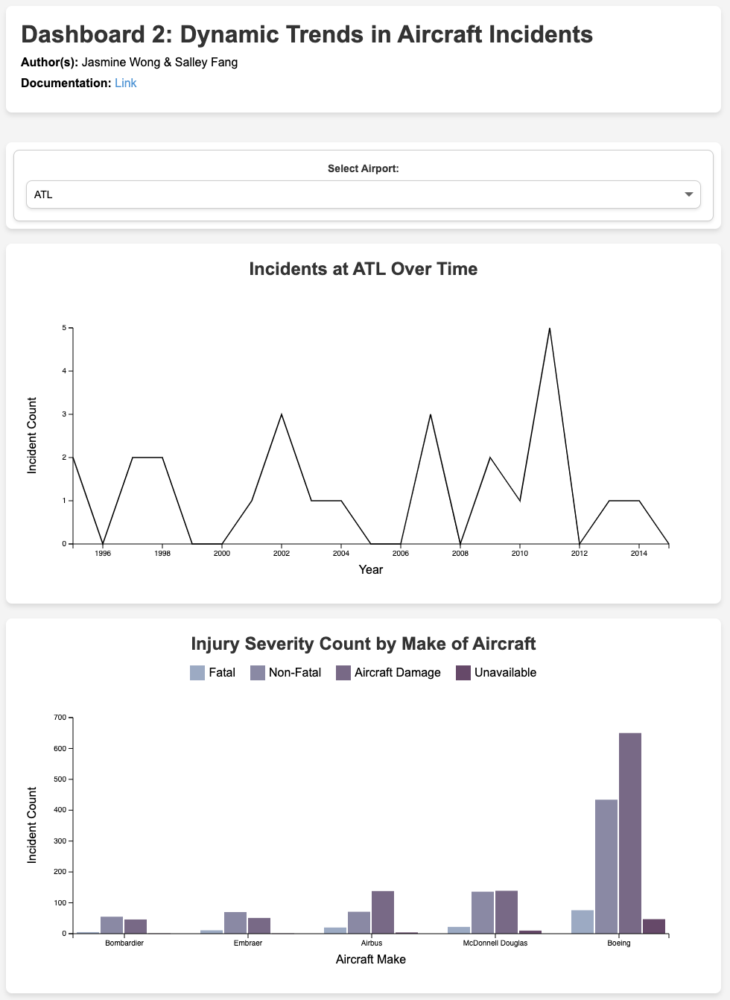

# Dynamic Trends in Aircraft Incidents Dashboard

## Dashboard Site
[Link to Dashboard](https://info-474-wi25.github.io/dash2-dynamic-trends-salleyfang/)

## About
[Dashboard 2: Dynamic Trends](https://docs.google.com/document/d/1sq1yJZUmW1MvwxXuSr9IpYa1Jc0f6EmoC0IWfP8PRnI/edit?usp=sharing)

## Documentation
[Classwork 5: Data Exploration of Aircraft Incidents](https://docs.google.com/document/d/1E_6SeF-Wcdg7D7T12PJvtyWQ_YiDOduHfOILv-U5dSQ/edit?usp=sharing
)

[Classwork 6: No-Code Draft (Dynamic Trends)](https://docs.google.com/document/d/1nQDyCoc00zsB3-z15ivYjvmaanjQLPHJQNQC_fI2OFo/edit?usp=sharing)

[Classwork 7: Code Set-up for Dash 2](https://docs.google.com/document/d/1gaz86RwKZ4KkckAiJMpYDYIfc6BqY40n2He5Z-0adB8/edit?usp=sharing)

[Classwork 8: Code Static Draft](https://docs.google.com/document/d/1pQsDsT_5SFmuI2bLrQgOa7ihHlEM5_KcxqvICcBGPUk/edit?usp=sharing)

[Classwork 9: Code Interactive Draft](https://docs.google.com/document/d/17t2le6kbGUFXEC1llShSQnIp0h_dL-a9oEwGyriupfk/edit?usp=sharing)

[Classwork 10: Critique Dynamic Trends](https://docs.google.com/document/d/18QGhiKN0m3ViypKr163nNL46IwbrUjnMfW2bKA2UeW4/edit?usp=sharing)

